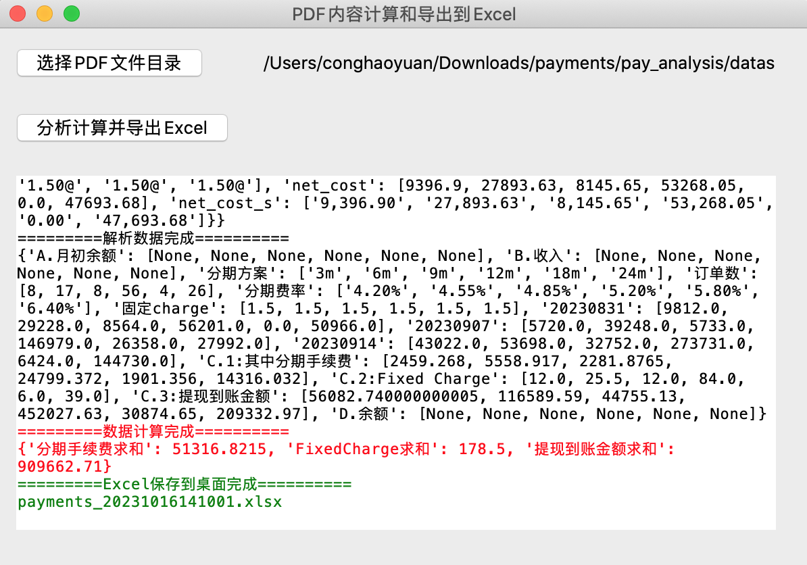
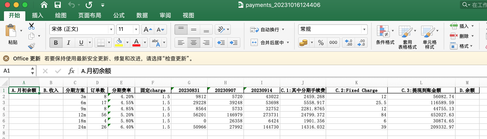

# 介绍

该工具可对pdf文档内表格进行数据提取，并可同时提取多个pdf文档表格数据。

并针对提取完成的数据进行分析、汇总、计算，最后输出到指定的excel文档中。




# 打包

```shell
pip install -r requirements.txt
or
pip3 install -r requirements.txt
```


```shell
pyinstaller -w --clean --name payments payments_w.py

```


